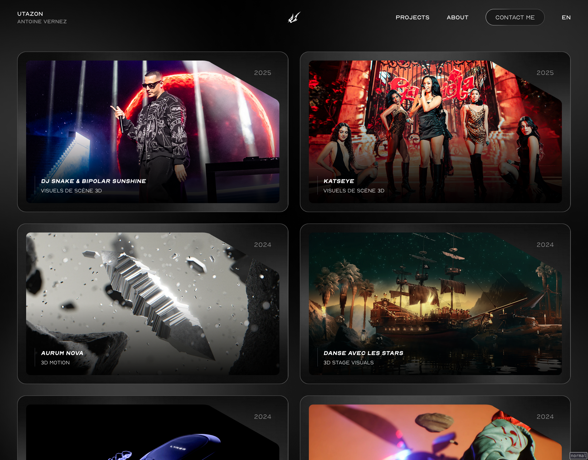
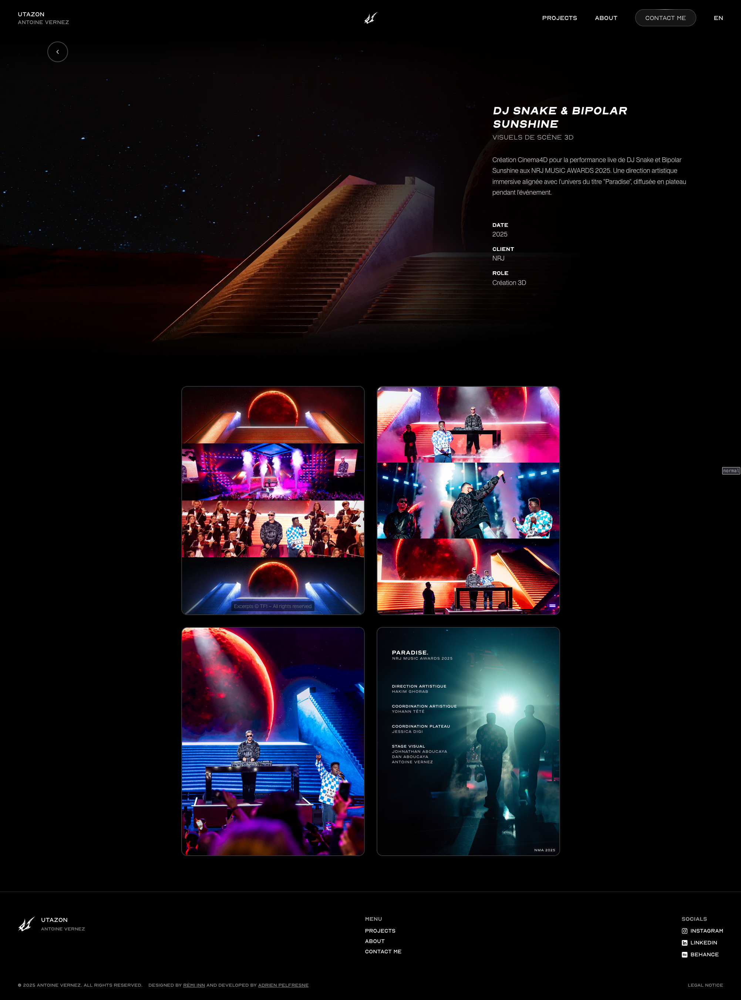

# Utazon (Antoine Vernez) Portfolio

Designed by [Rémi INN](https://www.linkedin.com/in/r%C3%A9mi-inn-485692200), Developped By [Adrien Pelfresne](https://www.linkedin.com/in/adrien-pelfresne/)

## 🕶️

## Stack

The portfolio is a React SPA, serving video and handling contact form through an [api](https://github.com/dirdr/utazon_backend)

React • TypeScript • Three.js • Framer Motion • Tailwind CSS • Wouter
